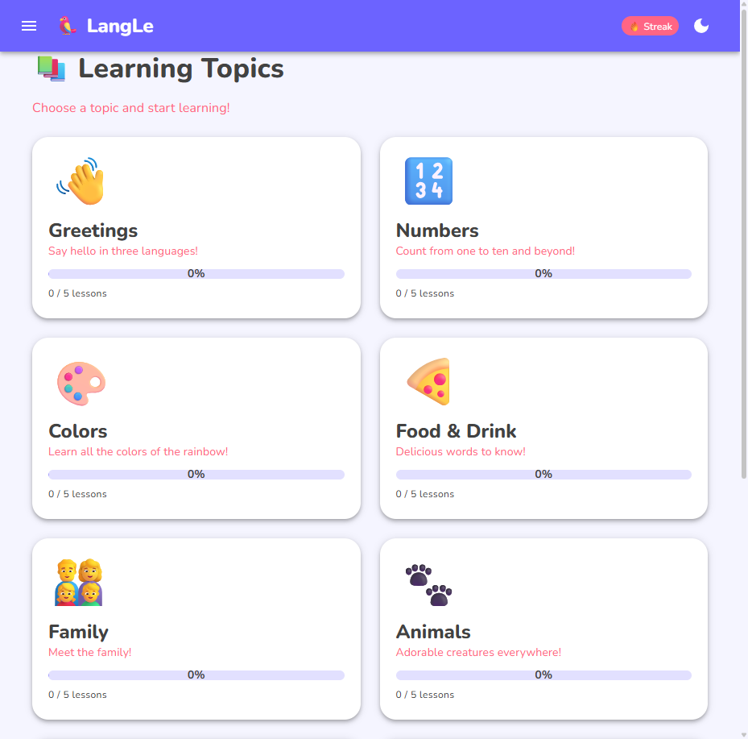
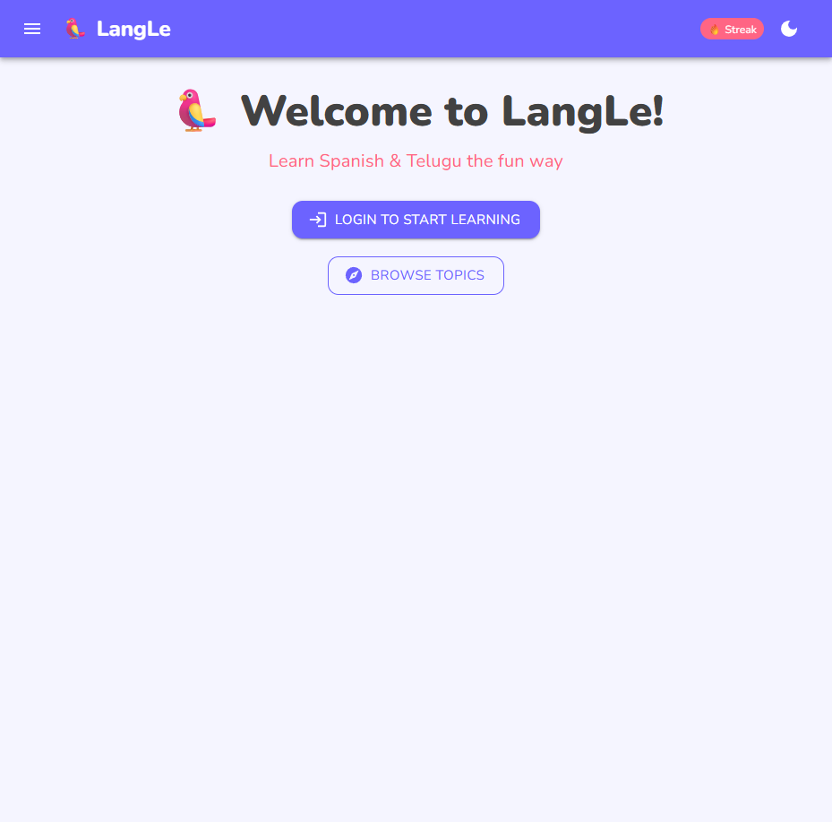
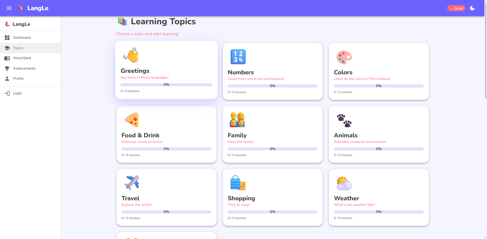
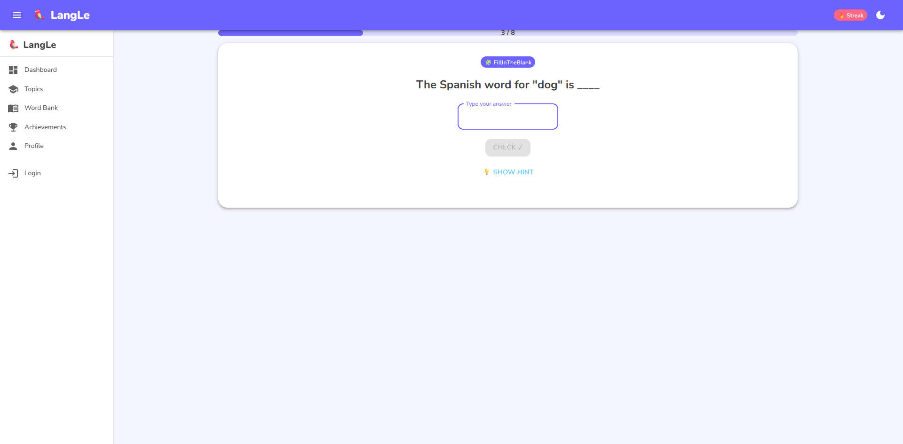
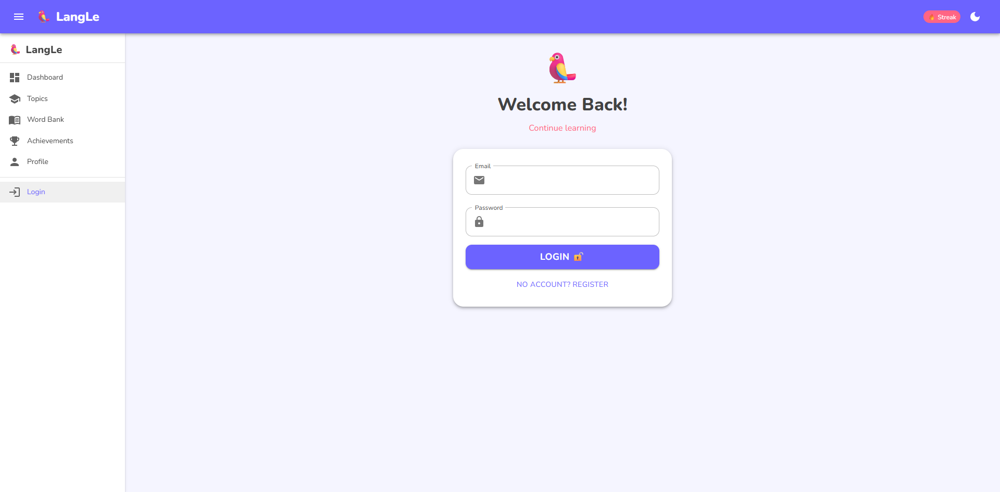

<div align="center">

# 🦜 LangLe

### Learn Languages the Fun Way — Spanish, Telugu & English

<br />

[](https://dotnet.microsoft.com/)
[](https://learn.microsoft.com/en-us/dotnet/aspire/)
[](https://blazor.net/)
[](https://www.postgresql.org/)
[](https://mudblazor.com/)
[](https://www.docker.com/)
[](https://learn.microsoft.com/en-us/ef/core/)
[](LICENSE)

*A Duolingo-inspired language learning platform built with .NET Aspire, Blazor Server, and PostgreSQL — featuring trilingual flip translations, gamified exercises, and a beautiful MudBlazor UI.*

<br />



<br />

---

### 🔢 Quick Stats

**`10` Topics** · **`50` Lessons** · **`400` Exercises** · **`100` Trilingual Words** · **`3` Languages** · **`4` Exercise Types** · **`10` Achievements**

---

[**Features**](#-features) · [**Screenshots**](#-screenshots) · [**Architecture**](#%EF%B8%8F-architecture) · [**Tech Stack**](#%EF%B8%8F-tech-stack) · [**Data Model**](#%EF%B8%8F-data-model) · [**API Reference**](#-api-reference) · [**Getting Started**](#-getting-started) · [**Roadmap**](#%EF%B8%8F-roadmap)

</div>

---

## 📋 Overview

**LangLe** is a modern, gamified language learning web application that makes picking up a new language feel effortless. Inspired by Duolingo, it delivers bite-sized daily lessons through interactive exercises — multiple choice, picture matching, translations, and fill-in-the-blank — all wrapped in a vibrant, playful UI.

### 🤔 Why LangLe?

| 🎯 Problem | 💡 Solution |
|-------------|-------------|
| Language courses feel overwhelming and too academic | **5-minute bite-sized lessons** with fun emoji-based exercises |
| Most apps only support popular language pairs | **Trilingual support:** English ↔ Spanish ↔ Telugu with instant flip |
| Learning feels like a chore | **Gamification:** XP points, daily streaks, star ratings, achievements |
| Hard to track progress | **Personal dashboard** with stats, weekly charts, and suggested next lessons |

### 🌍 Supported Languages

| Language | Code | Script | Status |
|----------|------|--------|--------|
| 🇺🇸 English | `en` | Latin | ✅ Base Language |
| 🇪🇸 Spanish | `es` | Latin | ✅ Fully Supported |
| 🇮🇳 Telugu | `te` | Telugu Script | ✅ Fully Supported |

> 📌 **Extensible by design** — adding new languages requires only seed data updates. The architecture supports unlimited language pairs.

### ⚡ How It Works

```
  1️⃣ Pick a Topic          2️⃣ Start a Lesson         3️⃣ Answer Exercises        4️⃣ Earn Rewards
 ┌───────────────┐       ┌───────────────┐       ┌───────────────┐       ┌───────────────┐
 │  Browse 10    │       │  Choose from  │       │  8 interactive│       │  ⭐ Stars     │
 │  fun topics   │──────>│  5 lessons    │──────>│  questions    │──────>│  🔥 Streaks   │
 │  with emojis  │       │  per topic    │       │  per lesson   │       │  🏆 Badges    │
 └───────────────┘       └───────────────┘       └───────────────┘       └───────────────┘
```

---

## ✨ Features

### 📚 Learning System

| Feature | Description |
|---------|-------------|
| **10 Topic Categories** | Greetings 👋, Numbers 🔢, Colors 🎨, Food & Drink 🍕, Family 👨‍👩‍👧‍👦, Animals 🐾, Travel ✈️, Shopping 🛍️, Weather ⛅, Time ⏰ |
| **50 Structured Lessons** | 5 progressive lessons per topic, each with 8 exercises |
| **400 Interactive Exercises** | Multiple Choice, Picture Match, Translation, Fill-in-the-Blank |
| **100 Trilingual Words** | 10 words per topic in English, Spanish, and Telugu |
| **Hint System** | Every exercise has a hint to keep learners from getting stuck |
| **Progress Tracking** | Per-lesson completion with percentage bars and star ratings |

### 🏆 Gamification & Motivation

| Feature | Description |
|---------|-------------|
| **XP Points** | Earn experience points for every correct answer |
| **Daily Streaks** 🔥 | Track consecutive learning days to build habits |
| **Star Ratings** ⭐ | Earn 1–3 stars per lesson based on accuracy |
| **10 Achievements** | Unlock badges: First Steps, Week Warrior, Vocabulary King, All Star, and more |
| **Dashboard Stats** | Total XP, streak count, lessons completed, words learned — all at a glance |
| **Weekly XP Chart** | Visualize your learning consistency over the past 7 days |

### 👤 User Experience

| Feature | Description |
|---------|-------------|
| **Register & Login** | Email-based authentication with ASP.NET Identity |
| **Personal Dashboard** | Stats cards, weekly chart, streak counter, suggested next lesson |
| **Topic Browser** | Beautiful emoji card grid with progress bars per topic |
| **Lesson Drawer** | Click a topic to reveal its lessons in a slide-out panel |
| **Word Bank** | Personal vocabulary collection of all words you've learned |
| **Achievement Gallery** | Track unlocked and locked achievements with progress |
| **User Profile** | Display name, learning stats, and goal management |
| **Dark Mode** 🌙 | Toggle between light and dark themes |
| **Responsive Design** | Works on desktop, tablet, and mobile viewports |

---

## 📸 Screenshots

<details open>
<summary><strong>🏠 Welcome Dashboard</strong> — Clean landing page with LeLe the parrot mascot</summary>
<br />
<div align="center">

</div>
</details>

<details open>
<summary><strong>📚 Learning Topics</strong> — 10 topic categories with emoji icons and progress bars</summary>
<br />
<div align="center">

</div>
</details>

<details>
<summary><strong>📝 Lesson Drawer</strong> — Click a topic to reveal its 5 lessons with exercise counts</summary>
<br />
<div align="center">

</div>
</details>

<details>
<summary><strong>🧩 Interactive Exercise</strong> — Picture Match, Multiple Choice, Translation & Fill-in-the-Blank</summary>
<br />
<div align="center">

</div>
</details>

<details>
<summary><strong>🔐 Authentication</strong> — Friendly login page with LeLe mascot and clean form design</summary>
<br />
<div align="center">

</div>
</details>

---

## 🏗️ Architecture

LangLe is built on **.NET Aspire** — Microsoft's cloud-ready stack for distributed applications. Aspire handles orchestration, service discovery, health checks, and container management automatically.

```
┌──────────────────────────────────────────────────────────────────────────┐
│                         .NET Aspire AppHost                              │
│              (Orchestration · Service Discovery · Health Checks)          │
├──────────────┬───────────────────────────┬───────────────────────────────┤
│              │                           │                               │
│  PostgreSQL  │    ASP.NET Core API       │    Blazor Server Frontend     │
│  (Docker)    │    (Backend)              │    (UI)                       │
│              │                           │                               │
│  • postgres  │  • Identity Auth          │  • MudBlazor 9 Components    │
│    :17.6     │  • EF Core 10             │  • 8 Interactive Pages       │
│  • langdb    │  • 13 REST Endpoints      │  • Custom Purple/Teal Theme  │
│  • Persistent│  • Business Services      │  • Dark Mode Support         │
│    Lifetime  │  • Seed Data (400 items)  │  • Responsive Layout         │
│              │                           │                               │
└──────────────┴───────────────────────────┴───────────────────────────────┘

Startup Chain:  PostgreSQL ──► API Service ──► Web Frontend
                (container)    (waits for DB)   (waits for API)
```

### How Aspire Orchestrates LangLe

| Step | Resource | What Happens |
|------|----------|-------------|
| 1️⃣ | **PostgreSQL** | Docker container starts with `postgres:17.6`, creates `langdb` database |
| 2️⃣ | **API Service** | Waits for PostgreSQL → runs EF Core migrations → seeds 400 exercises → starts HTTP endpoints |
| 3️⃣ | **Web Frontend** | Waits for API → connects via Aspire service discovery (`https+http://apiservice`) → serves Blazor UI |
| 🔍 | **Aspire Dashboard** | Monitors all resources with real-time logs, distributed traces, and health status |

### Solution Structure

```
LangLe/
├── 📄 LangLe.sln                              # Solution file
├── 📄 PRD.md                                   # Product Requirements Document
├── 📄 LICENSE                                  # MIT License
├── 📁 docs/                                    # Screenshots & documentation assets
│
├── 🎯 LangLe.AppHost/                         # .NET Aspire orchestration
│   └── AppHost.cs                              # PostgreSQL + API + Web wiring
│
├── 🔧 LangLe.ServiceDefaults/                 # Shared Aspire configuration
│   └── Extensions.cs                           # Health checks, OpenTelemetry, resilience
│
├── 🟦 LangLe.Shared/                          # Shared DTOs & Enums (5 projects reference this)
│   ├── DTOs/                                   # 8 Data Transfer Objects
│   │   ├── AuthDtos.cs                         # LoginRequest, RegisterRequest, AuthResponse
│   │   ├── TopicDto.cs                         # Topic with lesson count & progress
│   │   ├── LessonDto.cs                        # Lesson metadata
│   │   ├── ExerciseDto.cs                      # Exercise with options & correct answer
│   │   ├── DashboardDto.cs                     # Stats, weekly XP, suggested lesson
│   │   ├── WordBankEntryDto.cs                 # Trilingual word entry
│   │   ├── AchievementDto.cs                   # Achievement with unlock status
│   │   └── ProfileDto.cs                       # User profile data
│   └── Enums/                                  # 3 Enumerations
│       ├── ExerciseType.cs                     # MultipleChoice, PictureMatch, Translation, FillBlank
│       ├── GoalType.cs                         # DailyXP, DailyLessons, WeeklyDays
│       └── LanguageCode.cs                     # en, es, te
│
├── ⚙️ LangLe.ApiService/                      # ASP.NET Core Web API
│   ├── Program.cs                              # All endpoints + Identity + EF Core config
│   ├── Models/                                 # 11 Entity models
│   │   ├── AppUser.cs                          # Extends IdentityUser (DisplayName, XP, Streak)
│   │   ├── Topic.cs                            # Learning category (name, emoji, description)
│   │   ├── Lesson.cs                           # Belongs to Topic (order, title)
│   │   ├── Exercise.cs                         # Belongs to Lesson (question, options, answer)
│   │   ├── WordEntry.cs                        # Trilingual word (en, es, te + image)
│   │   ├── UserProgress.cs                     # Per-lesson completion (score, stars, XP)
│   │   ├── UserStreak.cs                       # Daily streak tracking
│   │   ├── UserGoal.cs                         # Personal learning goals
│   │   ├── UserWordBank.cs                     # Saved words per user
│   │   ├── Achievement.cs                      # Achievement definition
│   │   └── UserAchievement.cs                  # User ↔ Achievement unlock
│   ├── Data/
│   │   ├── LangLeDbContext.cs                  # EF Core context with Identity integration
│   │   └── SeedData.cs                         # 10 topics, 100 words, 50 lessons, 400 exercises
│   └── Services/
│       ├── LearningService.cs                  # Topics, lessons, exercises, completion logic
│       └── DashboardService.cs                 # Stats aggregation, weekly XP, suggestions
│
└── 🌐 LangLe.Web/                             # Blazor Server Frontend
    ├── Program.cs                              # MudBlazor + HttpClient setup
    ├── ApiClient.cs                            # Typed HTTP client for all API calls
    └── Components/
        ├── App.razor                           # Root component (MudBlazor CSS/JS, Nunito font)
        ├── Routes.razor                        # Router configuration
        ├── _Imports.razor                       # Global using statements
        ├── Layout/
        │   ├── MainLayout.razor                # MudBlazor layout + theme (purple/teal palette)
        │   └── NavMenu.razor                   # Sidebar navigation with icons
        └── Pages/
            ├── Home.razor                      # 🏠 Dashboard (stats, chart, streak, suggestions)
            ├── Login.razor                     # 🔐 Login + Register forms
            ├── Topics.razor                    # 📚 Topic grid with lesson drawer
            ├── Lesson.razor                    # 🧩 Exercise flow (8 per lesson)
            ├── WordBank.razor                  # 📖 Personal vocabulary collection
            ├── Achievements.razor              # 🏆 Achievement gallery
            ├── Profile.razor                   # 👤 User profile & settings
            └── Error.razor                     # ⚠️ Error page
```

---

## 🛠️ Tech Stack

| Layer | Technology | Version | Purpose |
|-------|-----------|---------|---------|
| **Orchestration** | [.NET Aspire](https://learn.microsoft.com/en-us/dotnet/aspire/) | 13.1.2 | Service discovery, health checks, container management |
| **Backend** | [ASP.NET Core](https://learn.microsoft.com/en-us/aspnet/core/) | 10.0 | Minimal API endpoints |
| **Frontend** | [Blazor Server](https://learn.microsoft.com/en-us/aspnet/core/blazor/) | 10.0 | Interactive server-rendered UI |
| **UI Framework** | [MudBlazor](https://mudblazor.com/) | 9.0.0 | Material Design components |
| **Database** | [PostgreSQL](https://www.postgresql.org/) | 17.6 | Relational data storage (Docker container) |
| **ORM** | [Entity Framework Core](https://learn.microsoft.com/en-us/ef/core/) | 10.0.1 | Database access & migrations |
| **Auth** | [ASP.NET Identity](https://learn.microsoft.com/en-us/aspnet/core/security/authentication/identity) | 10.0.0 | User registration, login, cookie auth |
| **DB Provider** | [Npgsql](https://www.npgsql.org/) | 10.0.0 | PostgreSQL EF Core provider |
| **Runtime** | [.NET](https://dotnet.microsoft.com/) | 10.0 | Cross-platform runtime |
| **Container** | [Docker](https://www.docker.com/) | Latest | PostgreSQL hosting via Aspire |
| **Observability** | [OpenTelemetry](https://opentelemetry.io/) | Built-in | Distributed traces, metrics, and logging |

---

## 🗄️ Data Model

### Entity Relationship Diagram

```
┌──────────────────┐       ┌──────────────────┐       ┌──────────────────┐
│     Topics       │       │     Lessons      │       │    Exercises     │
├──────────────────┤       ├──────────────────┤       ├──────────────────┤
│ Id            PK │──┐    │ Id            PK │──┐    │ Id            PK │
│ Name             │  │    │ TopicId       FK │  │    │ LessonId      FK │
│ Description      │  └───>│ Title            │  └───>│ Type (enum)      │
│ Emoji            │       │ Order            │       │ Question         │
│ ImageUrl         │       │ ExerciseCount    │       │ CorrectAnswer    │
└──────────────────┘       └──────────────────┘       │ OptionsJson      │
                                                      │ Hint             │
┌──────────────────┐       ┌──────────────────┐       │ ImageUrl         │
│    AppUser       │       │  UserProgress    │       └──────────────────┘
├──────────────────┤       ├──────────────────┤
│ Id (Identity) PK │──┐    │ Id            PK │       ┌──────────────────┐
│ DisplayName      │  │    │ UserId        FK │       │   WordEntry      │
│ TotalXp          │  └───>│ LessonId      FK │       ├──────────────────┤
│ CurrentStreak    │       │ Score            │       │ Id            PK │
│ LongestStreak    │       │ Stars            │       │ TopicId       FK │
│ LastActiveDate   │       │ XpEarned         │       │ English          │
└──────────┬───────┘       │ CompletedAt      │       │ Spanish          │
           │               └──────────────────┘       │ Telugu           │
           │                                          │ ImageUrl         │
           │  ┌──────────────────┐                    └──────────────────┘
           ├─>│   UserStreak     │
           │  ├──────────────────┤    ┌──────────────────┐
           │  │ UserId        FK │    │   Achievement    │
           │  │ Date             │    ├──────────────────┤
           │  │ MinutesStudied   │    │ Id            PK │
           │  └──────────────────┘    │ Name             │
           │                          │ Description      │
           │  ┌──────────────────┐    │ Icon             │
           ├─>│   UserGoal       │    │ Condition        │
           │  ├──────────────────┤    │ Threshold        │
           │  │ UserId        FK │    └────────┬─────────┘
           │  │ Type (enum)      │             │
           │  │ Target           │    ┌────────┴─────────┐
           │  └──────────────────┘    │ UserAchievement  │
           │                          ├──────────────────┤
           │  ┌──────────────────┐    │ UserId        FK │
           └─>│  UserWordBank    │    │ AchievementId FK │
              ├──────────────────┤    │ UnlockedAt       │
              │ UserId        FK │    └──────────────────┘
              │ WordEntryId   FK │
              │ AddedAt          │
              └──────────────────┘
```

### Seed Data Summary

| Category | Count | Details |
|----------|------:|---------|
| **Topics** | 10 | Each with unique emoji and description |
| **Words** | 100 | 10 trilingual words per topic (en/es/te) |
| **Lessons** | 50 | 5 progressive lessons per topic |
| **Exercises** | 400 | 8 exercises per lesson (mixed types) |
| **Achievements** | 10 | First Steps, Getting Started, Week Warrior, Vocabulary King, All Star, etc. |
| **DB Tables** | 11 | Including ASP.NET Identity tables for auth |

---

## 📡 API Reference

All endpoints are served from the API service with ASP.NET Identity cookie authentication.

### 🔐 Authentication

| Method | Endpoint | Auth | Description |
|--------|----------|------|-------------|
| `POST` | `/api/auth/register` | 🔓 Public | Register a new account |
| `POST` | `/api/auth/login` | 🔓 Public | Login with email & password |
| `POST` | `/api/auth/logout` | 🔒 Auth | Logout current session |
| `GET` | `/api/auth/me` | 🔒 Auth | Get current user info |

### 📚 Learning

| Method | Endpoint | Auth | Description |
|--------|----------|------|-------------|
| `GET` | `/api/topics` | 🔓 Public | List all topics with progress |
| `GET` | `/api/topics/{topicId}/lessons` | 🔓 Public | Get lessons for a topic |
| `GET` | `/api/lessons/{lessonId}/exercises` | 🔓 Public | Get exercises for a lesson |
| `POST` | `/api/lessons/complete` | 🔒 Auth | Submit lesson completion (score, XP) |

### 📊 User Data

| Method | Endpoint | Auth | Description |
|--------|----------|------|-------------|
| `GET` | `/api/dashboard` | 🔒 Auth | Dashboard stats, weekly XP, suggestions |
| `GET` | `/api/wordbank` | 🔒 Auth | User's saved word collection |
| `GET` | `/api/achievements` | 🔒 Auth | All achievements with unlock status |
| `PUT` | `/api/profile` | 🔒 Auth | Update display name & goals |

### 🏥 Health

| Method | Endpoint | Description |
|--------|----------|-------------|
| `GET` | `/health` | API health check (used by Aspire) |

<details>
<summary><strong>📦 Example API Responses</strong></summary>

#### `GET /api/topics` — List Topics
```json
[
  {
    "id": 1,
    "name": "Greetings",
    "description": "Say hello in three languages!",
    "emoji": "👋",
    "lessonCount": 5,
    "completedLessons": 2,
    "progressPercent": 40
  }
]
```

#### `GET /api/lessons/1/exercises` — Get Exercises
```json
[
  {
    "id": 1,
    "type": "PictureMatch",
    "question": "👋 What is this in Spanish?",
    "options": ["lo siento", "gracias", "hola", "bienvenido"],
    "correctAnswer": "hola",
    "hint": "It starts with 'h'",
    "imageUrl": null
  }
]
```

#### `GET /api/dashboard` — Dashboard Stats
```json
{
  "totalXp": 1250,
  "currentStreak": 7,
  "lessonsCompleted": 15,
  "wordsLearned": 42,
  "weeklyXp": [150, 200, 0, 100, 300, 250, 200],
  "suggestedLesson": {
    "id": 8,
    "title": "Colors - Lesson 3",
    "topicName": "Colors",
    "topicEmoji": "🎨"
  }
}
```

</details>

---

## 🚀 Getting Started

### Prerequisites

| Requirement | Version | Download |
|-------------|---------|----------|
| .NET SDK | 10.0+ | [dotnet.microsoft.com/download](https://dotnet.microsoft.com/download) |
| Docker Desktop | Latest | [docker.com/products/docker-desktop](https://www.docker.com/products/docker-desktop/) |
| .NET Aspire Workload | 13.x | `dotnet workload install aspire` |

### Quick Start

```bash
# 1. Clone the repository
git clone https://github.com/sunnynagavo/LangLe.git
cd LangLe

# 2. Ensure Docker Desktop is running
docker info

# 3. Install Aspire workload (if not already installed)
dotnet workload install aspire

# 4. Run the application 🚀
dotnet run --project LangLe.AppHost
```

### 🌐 Access Points

Once running, Aspire will display URLs in the console:

| Service | URL | Description |
|---------|-----|-------------|
| **🌐 Web App** | `https://localhost:7176` | LangLe frontend |
| **⚙️ API Service** | `https://localhost:7463` | REST API endpoints |
| **📊 Aspire Dashboard** | `https://localhost:17145` | Service health, logs, traces |
| **🗄️ PostgreSQL** | `localhost:5432` | Database (managed by Docker) |

> 💡 **Tip:** The Aspire Dashboard provides a login token in the console output. Use it to access detailed telemetry, distributed traces, and structured logs across all services.

### 🎮 First Steps After Launch

```
  Step 1                Step 2               Step 3               Step 4
 ┌──────────┐       ┌──────────────┐     ┌──────────────┐     ┌──────────────┐
 │ Open     │       │ Click        │     │ Register a   │     │ Earn XP,     │
 │ localhost│──────>│ Browse       │────>│ new account  │────>│ streaks &    │
 │ :7176    │       │ Topics       │     │ to track     │     │ achievements │
 └──────────┘       └──────────────┘     └──────────────┘     └──────────────┘
```

1. 🌐 Open `https://localhost:7176` in your browser
2. 📚 Click **Browse Topics** to explore all 10 learning categories
3. 📝 Click any topic → select a lesson → start answering exercises!
4. 👤 Click **Login** → **Register** to create an account for progress tracking
5. 🏆 Complete lessons to earn XP, stars, streaks, and achievements

---

## 🎨 Design System

LangLe uses a custom **MudBlazor** theme with a playful, educational aesthetic:

| Element | Value | Usage |
|---------|-------|-------|
| **Primary** | `#7C4DFF` (Deep Purple) | Navbar, buttons, active states |
| **Secondary** | `#00BFA5` (Teal) | Accents, progress bars, highlights |
| **Tertiary** | `#FF6B6B` (Coral) | Streak badges, alerts, emphasis |
| **Background** | `#F3E5F5` (Lavender) | Page background (light mode) |
| **Surface** | `#FFFFFF` (White) | Cards and content areas |
| **Font** | [Nunito](https://fonts.google.com/specimen/Nunito) | Rounded, friendly, easy to read |
| **Mascot** | 🦜 LeLe | Friendly parrot guide throughout the app |

### Exercise Types

| Type | Icon | Interaction | Example |
|------|------|-------------|---------|
| **Multiple Choice** | 🔤 | Select the correct translation from 4 options | "What is 'Hello' in Spanish?" → hola |
| **Picture Match** | 📸 | Match an emoji/image to its translation | 🐕 → "perro" |
| **Translation** | 🌐 | Type the translation of a given word | "Translate 'water' to Telugu" → నీళ్ళు |
| **Fill in the Blank** | 🧩 | Complete a sentence with the missing word | "Uno, ___, tres" → dos |

---

## 📚 Trilingual Content Sample

Here's a peek at the kind of content LangLe teaches across all 10 topics:

| Topic | 🇺🇸 English | 🇪🇸 Spanish | 🇮🇳 Telugu |
|-------|-------------|-------------|------------|
| 👋 Greetings | Hello | Hola | నమస్కారం |
| 👋 Greetings | Thank you | Gracias | ధన్యవాదాలు |
| 🔢 Numbers | One | Uno | ఒకటి |
| 🎨 Colors | Red | Rojo | ఎరుపు |
| 🍕 Food & Drink | Water | Agua | నీళ్ళు |
| 👨‍👩‍👧‍👦 Family | Mother | Madre | అమ్మ |
| 🐾 Animals | Dog | Perro | కుక్క |
| ✈️ Travel | Airport | Aeropuerto | విమానాశ్రయం |
| 🛍️ Shopping | Money | Dinero | డబ్బు |
| ⛅ Weather | Rain | Lluvia | వర్షం |
| ⏰ Time | Today | Hoy | ఈరోజు |

---

## 🗺️ Roadmap

### ✅ v1.0 — Current Release

- [x] .NET Aspire orchestration with PostgreSQL Docker container
- [x] ASP.NET Core API with 13 REST endpoints
- [x] ASP.NET Identity authentication (register, login, logout)
- [x] Blazor Server frontend with MudBlazor rich UI
- [x] 10 learning topics with emoji icons
- [x] 50 lessons × 8 exercises = 400 interactive exercises
- [x] 4 exercise types (Multiple Choice, Picture Match, Translation, Fill-in-the-Blank)
- [x] Trilingual content: English ↔ Spanish ↔ Telugu
- [x] Gamification: XP, streaks, stars, achievements
- [x] Dashboard with stats, weekly chart, suggested lessons
- [x] Word Bank & Achievement gallery
- [x] Dark mode support
- [x] Responsive sidebar navigation

### 🔜 v1.1 — Enhanced Learning

- [ ] Audio pronunciation for all words (text-to-speech)
- [ ] Confetti animations on lesson completion
- [ ] Animated mascot reactions (LeLe celebrates correct answers)
- [ ] Sound effects for correct/incorrect answers
- [ ] Spaced repetition algorithm for word review
- [ ] Sentence-building exercises (drag and drop)

### 🔮 v2.0 — Social & Expansion

- [ ] Additional languages (French, Hindi, Japanese, Korean)
- [ ] Leaderboards and friend challenges
- [ ] Daily challenge mode
- [ ] Offline mode with Progressive Web App (PWA)
- [ ] Mobile-optimized touch gestures
- [ ] Redis caching for performance
- [ ] Azure Container Apps deployment
- [ ] CI/CD with GitHub Actions
- [ ] Unit & integration test suite

---

## 🧩 Exercise Flow

```
┌─────────────┐     ┌──────────────┐     ┌──────────────┐     ┌─────────────┐
│  Topics     │────>│  Lessons     │────>│  Exercises   │────>│ Completion  │
│  (10 cards) │     │  (5 per topic│     │  (8 per      │     │  Screen     │
│             │     │   in drawer) │     │   lesson)    │     │             │
│  👋 🔢 🎨   │     │  Lesson 1    │     │  Q1: 📸     │     │  ⭐⭐⭐      │
│  🍕 👨‍👩‍👧‍👦 🐾  │     │  Lesson 2    │     │  Q2: 🔤     │     │  +150 XP    │
│  ✈️ 🛍️ ⛅  │     │  Lesson 3    │     │  Q3: 🌐     │     │  🔥 Streak! │
│  ⏰          │     │  ...         │     │  ...         │     │  🏆 Badge!  │
└─────────────┘     └──────────────┘     └──────────────┘     └─────────────┘
     Browse              Select              Answer              Celebrate!
```

---

## 📄 Documentation

| Document | Description |
|----------|-------------|
| [Product Requirements (PRD)](PRD.md) | Full product requirements, user stories, feature specifications, and data models |
| [Aspire Dashboard Guide](https://learn.microsoft.com/en-us/dotnet/aspire/fundamentals/dashboard/overview) | Learn about the .NET Aspire developer dashboard |
| [MudBlazor Docs](https://mudblazor.com/docs/overview) | UI component library documentation |
| [EF Core Docs](https://learn.microsoft.com/en-us/ef/core/) | Entity Framework Core documentation |

---

## 🤝 Contributing

Contributions are welcome! Here's how to get started:

1. **Fork** the repository
2. **Create** a feature branch (`git checkout -b feature/amazing-feature`)
3. **Commit** your changes (`git commit -m 'Add amazing feature'`)
4. **Push** to the branch (`git push origin feature/amazing-feature`)
5. **Open** a Pull Request

### 🧑‍💻 Development Tips

```bash
# Build the solution
dotnet build LangLe.sln

# Run with Aspire (starts all services + PostgreSQL Docker container)
dotnet run --project LangLe.AppHost

# Run with hot reload (watches for code changes)
dotnet watch --project LangLe.AppHost

# View Aspire dashboard for real-time logs, traces & metrics
# URL + login token printed in console on startup
```

### Project Conventions

| Convention | Details |
|-----------|---------|
| **Architecture** | .NET Aspire with service-per-concern |
| **API Style** | Minimal APIs (no controllers) |
| **Database** | Code-first with EF Core (`EnsureCreated` + seed) |
| **DTOs** | Shared project referenced by both API and Web |
| **Auth** | Cookie-based with ASP.NET Identity |
| **UI** | MudBlazor components with custom theme |
| **Target Framework** | `net10.0` |

---

## 📝 License

This project is licensed under the MIT License — see the [LICENSE](LICENSE) file for details.

---

<div align="center">

### Built with ❤️ using .NET Aspire, Blazor Server, MudBlazor & PostgreSQL

🦜 *LeLe says: "¡Hola! నమస్కారం! Start learning today!"*

*A language learning application for educational and demonstration purposes.*

[](https://github.com/sunnynagavo)

*Last updated: March 2026*

</div>
